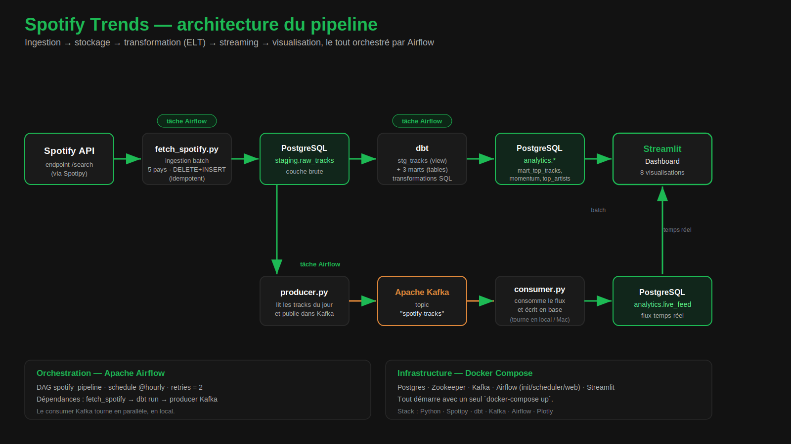

# Spotify Trends Pipeline

Pipeline ETL complet qui collecte, transforme et visualise les tendances musicales mondiales à partir de l'API Spotify.

Projet réalisé dans le cadre du cours ETL — ESILV M1 Data & IA.

---

## Stack technique

| Composant | Rôle |
|---|---|
| **Spotify API** (Spotipy) | Source de données — récupère les tracks populaires par pays |
| **PostgreSQL** | Stockage des données brutes et transformées |
| **dbt** | Transformation des données (nettoyage, agrégats) |
| **Apache Kafka** | Streaming temps réel des tracks entre le producer et le consumer |
| **Apache Airflow** | Orchestration du pipeline (toutes les heures) |
| **Streamlit** | Dashboard de visualisation |
| **Docker** | Conteneurisation de tous les services |

---

## Architecture

```
Spotify API
    │
    ▼
fetch_spotify.py          ← ingestion : on appelle l'API et on stocke les données brutes
    │
    ▼
staging.raw_tracks        ← données brutes dans PostgreSQL (une ligne = un track par pays et par jour)
    │
    ▼
dbt models                ← transformation : nettoyage, calcul du top, momentum artistes
    │
    ▼
analytics.*               ← données prêtes pour le dashboard (mart_top_tracks, mart_artist_momentum...)
    │
    ├──▶ producer.py ──▶ Kafka ──▶ consumer.py ──▶ analytics.live_feed   (flux temps réel)
    │
    ▼
Streamlit Dashboard       ← visualisation finale

Tout le pipeline est orchestré par Apache Airflow (déclenchement toutes les heures).
```



---

## Structure du projet

```
spotify-pipeline/
├── ingestion/
│   └── fetch_spotify.py        # appel API Spotify + insertion en base
├── dbt_project/
│   └── models/
│       ├── staging/
│       │   └── stg_tracks.sql  # nettoyage et typage des données brutes
│       └── marts/
│           ├── mart_top_tracks.sql       # top 10 par pays et par jour
│           ├── mart_top_artists.sql      # top artistes avec nombre de tracks
│           └── mart_artist_momentum.sql  # progression vs la veille
├── kafka/
│   ├── producer.py             # publie les tracks dans le topic Kafka
│   └── consumer.py             # consomme et insère dans live_feed
├── airflow/
│   └── dags/
│       └── dag_spotify_pipeline.py  # orchestration du pipeline
├── dashboard/
│   └── app.py                  # dashboard Streamlit
├── sql/
│   └── init.sql                # création des schémas et tables PostgreSQL
└── docker-compose.yml          # tous les services en un seul fichier
```

---

## Lancer le projet

### Étape 1 — Crée un fichier `.env` avec tes clés Spotify

Crée un compte sur [developer.spotify.com](https://developer.spotify.com), crée une app et récupère tes clés.

```
SPOTIFY_CLIENT_ID=ton_client_id
SPOTIFY_CLIENT_SECRET=ton_client_secret
```

> Les clés utilisent le flux **Client Credentials** (pas d'OAuth utilisateur). Il faut quand même renseigner un Redirect URI dans le dashboard Spotify — mets `http://127.0.0.1:8080`, il ne sera pas utilisé.

### Étape 2 — Lance tous les services Docker

```bash
docker-compose up -d
```

Attends ~5 minutes que tout démarre (Airflow installe ses dépendances au premier lancement).

### Étape 3 — Vérifie que tout tourne

```bash
docker ps
```

Tu dois voir 5 containers `Up` : `postgres`, `zookeeper`, `kafka`, `airflow`, `streamlit`.

### Étape 4 — Vérifie qu'Airflow est prêt

```bash
docker logs spotify_airflow --tail 5
```

Tu dois voir : `Listening at: http://0.0.0.0:8080`

### Étape 5 — Lance le pipeline depuis Airflow

- Va sur [http://localhost:8080](http://localhost:8080)
- Login : `admin` / `admin`
- Cherche `spotify_pipeline`, active-le et clique sur ▶️

### Étape 6 — Lance le consumer Kafka (dans un nouveau terminal)

```bash
pip install -r requirements.txt
python kafka/consumer.py
```

### Étape 7 — Ouvre le dashboard

- Va sur [http://localhost:8501](http://localhost:8501)

---

## Données collectées

Le pipeline collecte des données pour 5 marchés : **France, États-Unis, Japon, Brésil, Royaume-Uni**.

Pour chaque pays, on récupère jusqu'à 50 tracks par jour via 5 requêtes de recherche (`"pop hits"`, `"top charts"`, `"hits 2025"`, etc.).

### Comment la popularité est calculée

L'API Spotify en accès basique (sans OAuth) ne donne pas accès au champ `popularity` officiel ni aux charts. On utilise donc un **proxy basé sur le rang** dans les résultats de recherche :

- Spotify trie déjà ses résultats du plus populaire au moins populaire
- Le 1er résultat obtient un score de 95, le 2ème 94, etc. (minimum 50)
- Un bruit aléatoire entre -3 et +3 est ajouté pour éviter des scores trop mécaniques
- Le score est toujours compris entre 50 et 99

---

## Dashboard

Le dashboard Streamlit propose 8 visualisations :

| Graphique | Description |
|---|---|
| Top 5 Artistes | Artistes avec la meilleure popularité moyenne du jour |
| Top 10 Tracks | Tracks les mieux classés, depuis le modèle dbt `mart_top_tracks` |
| Carte mondiale | Popularité moyenne par pays sur une carte choroplèthe |
| Momentum artistes | Progression vs la veille (vert = monte, rouge = descend) |
| Heatmap inter-pays | Présence des top artistes dans chaque marché |
| Distribution des popularités | Box plot comparant la répartition des scores par pays |
| Top 8 Albums | Albums avec la meilleure popularité du jour |
| Évolution temporelle | Courbe de popularité jour par jour pour un artiste donné |

Un filtre **Global** regroupe tous les pays et un toggle active/désactive le rafraîchissement automatique toutes les 10 secondes.

---

## Limites connues

- La popularité est un proxy (rang de recherche) et non le score officiel Spotify — les valeurs sont donc approximatives.
- L'API Spotify limite les appels : avec un compte développeur standard, on peut faire ~180 requêtes par tranche de 30 secondes.
- Le graphique d'évolution temporelle nécessite au minimum 2 jours de collecte pour être utile.
- Le momentum artistes n'est disponible qu'après 2 jours de données.
